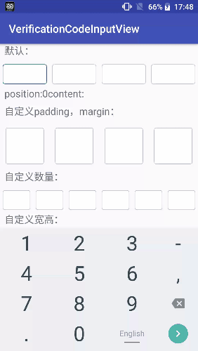
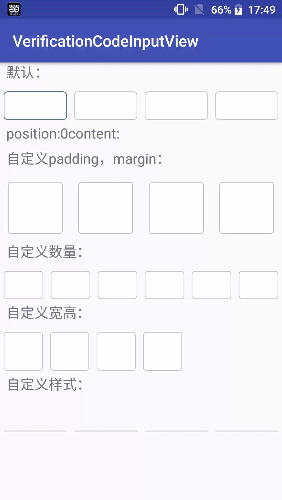

# VerificationCodeInputView
数字验证码输入控件，支持所有键盘，可完美输入删除



## 获取方式
#### Add it in your root build.gradle at the end of repositories:

	allprojects {
		repositories {
			...
			maven { url 'https://jitpack.io' }
		}
	}
#### Step 2. Add the dependency

	dependencies {
	        compile 'com.github.yan010:VerificationCodeInputView:v1.0'
	}

## 使用方式

在xml文件中可直接使用
```
     <com.yanqi.verificationcodeinputview.VerificationInputCodeView
        android:id="@+id/code"
        android:layout_width="match_parent"
        android:layout_height="wrap_content" />
```
可以注册监听来实现监听每一步输入，以及完成事件
```
mInputCodeView.setmOnKeyEvent(new VerificationInputCodeView.OnKeyEvent() {
            @Override
            public void onCodeChange(int position, String content) {
            }

            @Override
            public void onFinishCode(List<String> codeData) {
            }
        });
```
如果需要自定义可以通过配置相应属性来进行设置，目前支持以下自定义：
```
<com.yanqi.verificationcodeinputview.VerificationInputCodeView
        android:layout_width="match_parent"
        android:layout_height="wrap_content"
        app:average="false"
        app:childHeight="50dp"
        app:childWidth="50dp"
        app:margin="10dp"
        app:padding="20dp"
        app:paddingLeft="20dp"
        app:paddingRight="20dp"
        app:paddingTop="20dp"
        app:paddingBottom="20dp"
        app:marginLeft="20dp"
        app:marginRight="20dp"
        app:marginTop="20dp"
        app:marginBottom="20dp"
        app:textSize="20dp"
        app:textColor="@color/colorAccent"
        app:focusDrawable="@drawable/code_input_focus_bg"
        app:normalDrawable="@drawable/code_input_normal_bg"
        app:number="4" />
```



## 讨论

QQ: 799782239  (注明github数字验证码项目+您的称呼)
